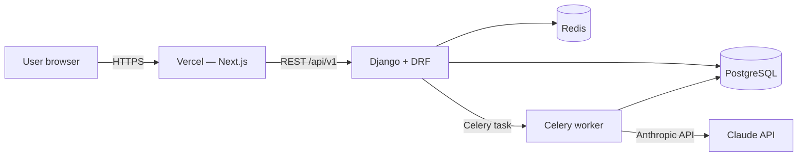

# Architecture

## Request lifecycle: a reading

1. User submits question + chosen spread type → `POST /api/v1/readings/`
2. Backend draws cards (random, deterministic seed stored), persists `Reading` + `ReadingCard[]`, returns reading id immediately
3. Backend enqueues Celery task `generate_interpretation(reading_id)`
4. Frontend opens SSE stream on `GET /api/v1/readings/{id}/stream/`
5. Worker loads prompt + card data, calls Claude, streams chunks back via Redis pubsub
6. Backend pushes chunks down SSE to frontend, frontend renders progressively
7. Final body persisted to `Interpretation`

## Why this layout

- **Anonymous users supported** — `Reading.user` is nullable; sessions tracked by cookie until sign-in
- **Streaming UX** — readings feel alive instead of "loading spinner for 10 seconds"
- **Cost containment** — rate limit at the view, kill switch at the worker
- **Soft-delete everywhere** — `deleted_at` on `Reading`, never hard-delete user data
