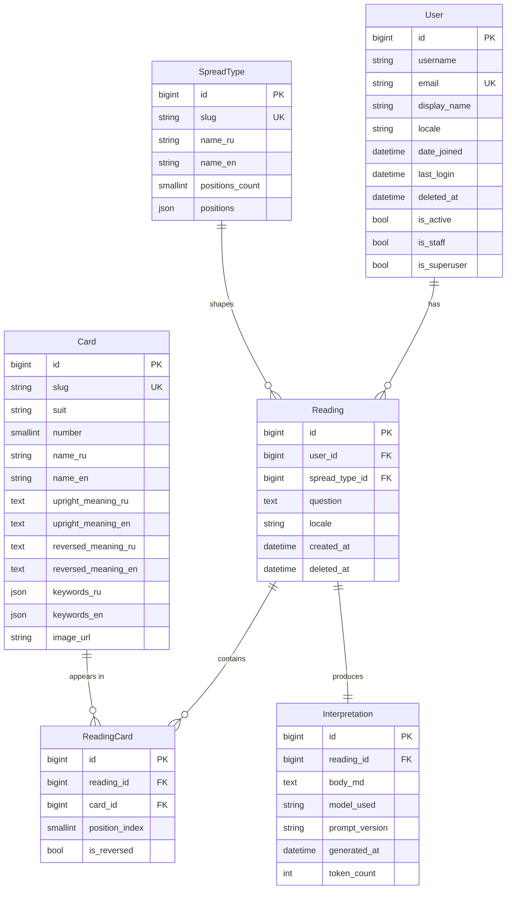

# Database Schema

Owned by `database-agent`. Edit through migrations, never hot-patch production.



## Indexes (must exist)

- `User.email` — unique
- `Card.slug` — unique
- `Card(suit, number)` — composite, for browsing
- `Reading(created_at)` — descending, for history page
- `Reading(user_id, created_at)` — composite, for user history
- `ReadingCard(reading_id, position_index)` — unique together

## Migrations

| App | Migration | Description |
|-----|-----------|-------------|
| `users` | `0001_initial` | Custom User (extends AbstractUser), email as USERNAME_FIELD |
| `tarot` | `0001_initial` | Card (78-card deck) and SpreadType models |
| `readings` | `0001_initial` | Reading, ReadingCard, Interpretation |

To apply:
```bash
python manage.py migrate
```

## Seed Data

Load the Rider-Waite deck and spread types:
```bash
python manage.py seed_deck
```

This command is **idempotent** — safe to run multiple times. It uses `update_or_create` on `slug`.

Source files:
- `data/deck/rider-waite.json` — 78 cards (Major Arcana fully populated; Minor Arcana stubs pending `content-agent`)
- `data/deck/spread-positions.json` — spread type definitions
